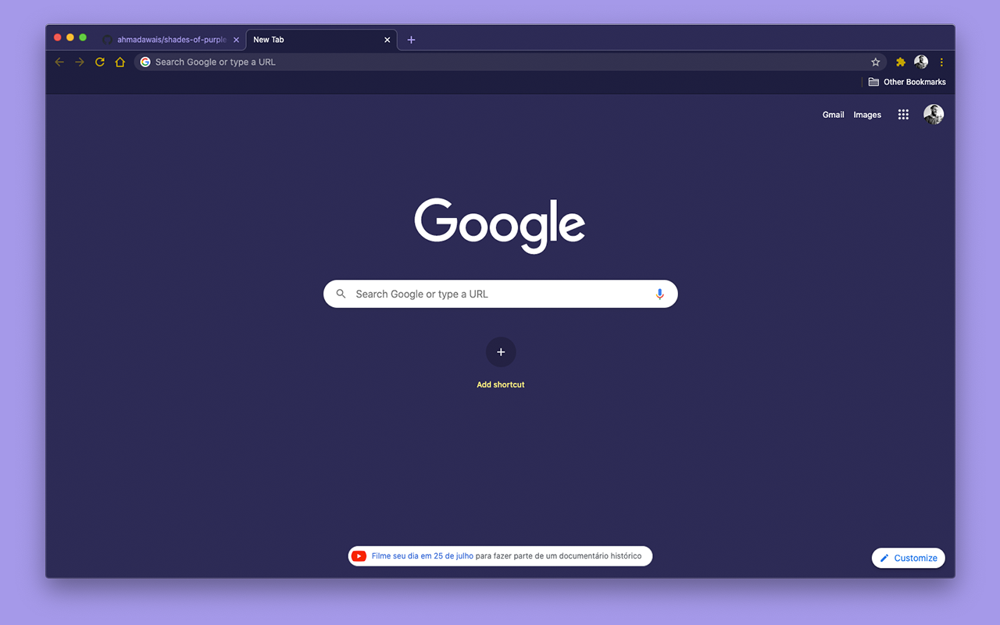
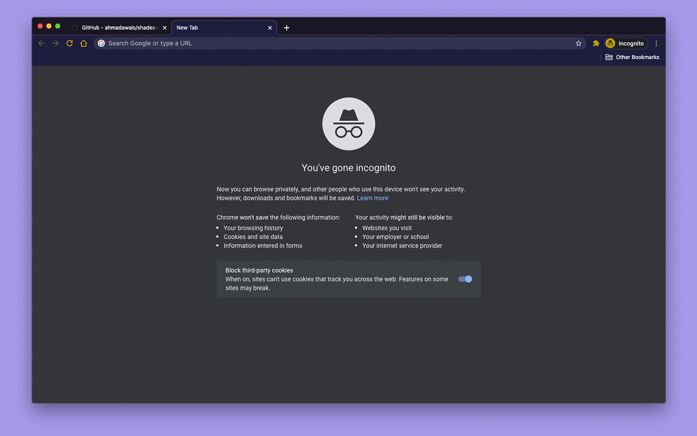

  

<h1 align="center">Shades of Purple Theme for Google Chrome</h1>
<h5 align="center">Google Chrome color scheme based on the amazing VSCode theme <a href="https://github.com/ahmadawais/shades-of-purple-vscode">Shades of Purple</a> by <a href="https://github.com/ahmadawais">Ahmad Awais</a>.</h5>
 

  
  
  
  
  

 

## Table of Contents

- [Table of Contents](#table-of-contents)
- [Screenshots](#screenshots)
- [Installation](#installation)
- [Roadmap](#roadmap)
- [Contributing](#contributing)
  - [Contributors](#contributors)
- [Inspired By](#inspired-by)
- [Changelog](#changelog)
- [License](#license)

## Screenshots

  

  

## Installation

Install the theme through the [Google Chrome Store](https://chrome.google.com/webstore/detail/aomhpijmdccjapkfcbalcoimhdlbkfjn).

## Roadmap

See the [open issues](https://github.com/demartini/shades-of-purple-google-chrome/issues) for a list of proposed features (and known issues).

## Contributing

If you are interested in helping contribute, please take a look at our [Contributing](CONTRIBUTING.md) guide.

### Contributors

## Inspired By

- The amazing VSCode theme [Shades of Purple](https://github.com/ahmadawais/shades-of-purple-vscode) by [Ahmad Awais](https://github.com/ahmadawais).

## Changelog

See [Changelog](CHANGELOG.md) for a human-readable history of changes.

## License

Distributed under the MIT License. See [LICENSE](LICENSE) for more information.
